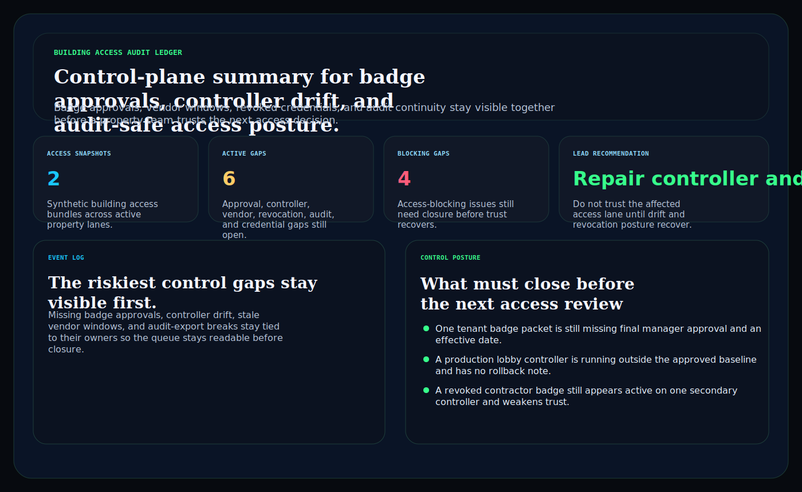
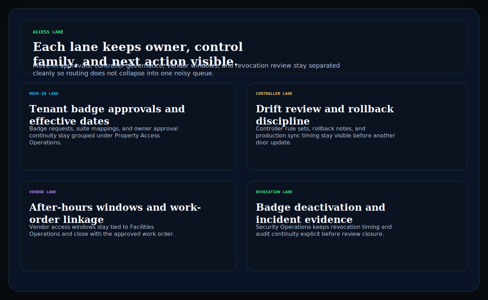
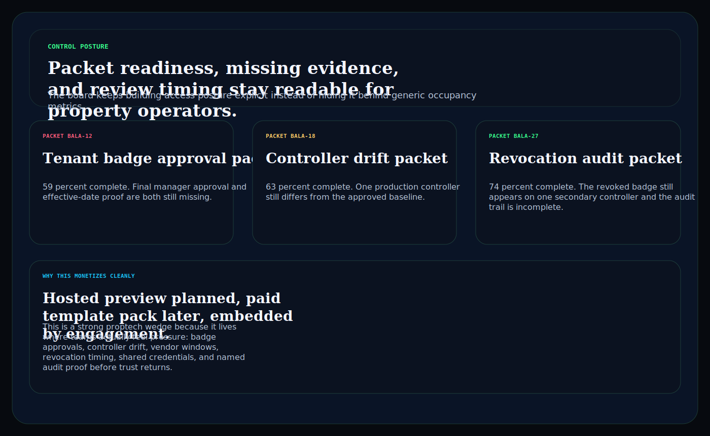

# building-access-audit-ledger

C# / ASP.NET operator surface for building access events, credential control gaps, controller drift, revocation pressure, vendor continuity, and final audit posture.

## Why this matters

PropTech and real-estate operations teams do not need another generic building dashboard. They need one board where badge packets, tenant approvals, controller changes, vendor access windows, and audit evidence stay visible together before stale credentials or weak access reviews turn into property risk.

This repo is the public proof surface for that pattern:

- `Hosted preview planned` for a browser-based building access audit desk
- `Embedded by engagement` for teams that need the routing model inside a property-ops, access-control, or tenant workflow

## What it includes

- ASP.NET Core minimal API in C#
- synthetic building access snapshots, control gaps, and audit packets
- operator surfaces for:
  - `/access-lane`
  - `/event-log`
  - `/control-posture`
  - `/verification`
  - `/docs`
- structured JSON endpoints under `/api/*`
- static Pages export with `robots.txt`, `sitemap.xml`, and `CNAME`

## Screenshots





## Verification

- synthetic building access and audit evidence only
- no resident PII, live badge identifiers, or proprietary controller secrets
- no claim of SOC 2, life-safety certification, or regulatory compliance
- this is a proptech operator proof surface for access-governance workflow depth, not a certification claim

## Local run

```powershell
dotnet test
dotnet run --project src/BuildingAccessAuditLedger.Api -- --demo
dotnet run --project src/BuildingAccessAuditLedger.Api
```

Then open:

- `http://127.0.0.1:5094/`
- `http://127.0.0.1:5094/access-lane`
- `http://127.0.0.1:5094/event-log`
- `http://127.0.0.1:5094/control-posture`

## Render static site

```powershell
dotnet run --project src/BuildingAccessAuditLedger.Api -- --prerender
```

## Related docs

- [Embedded framing](./docs/KINETIC_GAIN_EMBEDDED.md)
- [Origin story](./docs/ORIGIN.md)
